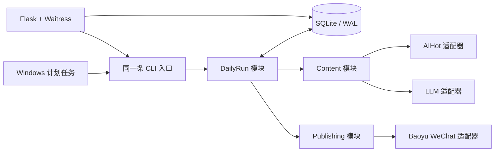

# AI 日报稳定性重构技术规格

## 已确认的目标

在不迁移到 React、FastAPI、云服务器或微服务的前提下，把本地 Windows 工具改造成可恢复、可追溯、不会重复发布的每日流程。微信公众号 IP 白名单仍由使用者每天手动维护；这不在本次自动化范围内。

## 范围与取舍

保留 Flask、Jinja 模板和原生 JavaScript，避免为一个本地单用户工具引入前端构建链。Flask 不再运行开发服务器，而由 Waitress 承载。保留 Bun/TypeScript 的 `baoyu-post-to-wechat` 开源发布器，作为唯一的微信发布适配器；不自行实现微信协议。

不引入 React/Vue、FastAPI、Redis、Celery、Docker、PostgreSQL、ORM 或微服务。它们不会解决当前的重复执行、状态丢失、任务计划失败和发布结果不可信问题，反而会增加维护面。

## 目标目录

项目根目录只保留 Git 元数据、`.gitignore` 和三个业务目录：

```text
app/       运行代码、依赖定义、测试、脚本、运行数据、第三方运行适配器
design/    UI、UX、组件与视觉参考稿
docs/      PRD、SPEC、README、实施计划、第三方说明
```

`skills/` 会迁入 `app/vendor/`：它们是项目运行所依赖的第三方适配器，不是项目说明文档。根目录的 `run.bat` 和 `run_scheduled.bat` 会迁入 `app/scripts/`。未被 Git 跟踪的旧根目录 `.env` 不读取、不移动；新程序优先读取 `app/.env`，同时兼容旧路径一次，避免升级当天失效。

## 运行架构



Web 页面不再持有文章或进度，也不会因浏览器重连而启动第二次工作。它只创建或查看一个 `run_id`；真实进度、文章、封面路径和发布回执都写入 SQLite。计划任务和手动操作调用同一个 CLI，因此不会出现两套不同流程。

## 四个深模块

| 模块 | 对外接口 | 隐藏的复杂性 |
| --- | --- | --- |
| `DailyRun` | `prepare(date)`、`publish(date)`、`get(date)` | 同日互斥、状态转换、恢复已有成果、重复发布拦截、事件记录 |
| `Content` | `build(date, settings)` | 抓取、字段规范化、保留原始链接、提示词隔离、LLM 重试和严格结果校验 |
| `Publishing` | `publish(article, cover, settings)` | Markdown 文件、Bun 进程、超时、草稿回执、临时文件清理 |
| `WindowsTasks` | `install(time)`、`inspect()` | 引号、命令行、任务 XML、退出码与任务存在性检查 |

AIHot、LLM、微信和 Windows 任务计划都是外部依赖，采用生产适配器与测试替身两种实现。测试只通过上述模块的接口验证可观察结果，不依赖网络、微信或真实计划任务。

## 数据与状态规则

SQLite 使用 WAL 模式；`daily_runs` 以日期唯一，保存状态、文章 JSON、Markdown、封面路径、草稿 `media_id`、错误摘要和时间。状态只能按以下顺序前进：

```text
queued -> scraping -> rewriting -> ready -> publishing -> published
                         \-> failed              \-> failed
```

- 同一天已 `published`：直接返回已记录的回执，绝不再次创建草稿。
- 同一天 `ready`：直接使用已持久化的文章发布，不重新请求 LLM。
- 正在处理：第二个请求得到“正在运行”，不会创建第二条线程。
- 失败：保留错误和已完成成果；用户明确重试时才重新开始失败阶段。
- 自动任务不再由“检查任务”盲目重新触发主任务。任务计划自身的失败重试与 `DailyRun` 的幂等性共同保证安全。

## 内容与安全规则

抓取时保留标题、摘要、来源名、原始链接、永久链接和归属信息。原始内容只能进入 LLM 的用户消息，并明确标记为“不可信参考资料”；系统提示词不再拼入抓取内容。LLM 返回的 JSON 必须有完整且等量的条目，链接以原始抓取记录为准。解析失败或内容校验失败会使运行失败，不能把未改写的原文悄悄发布。

Markdown 为每条新闻保留可追溯链接；发布时不再传 `--no-cite`，沿用 Baoyu 的默认引用转换。页面预览用 DOM 节点和 `textContent` 生成，禁止把抓取/LLM 内容直接写进 `innerHTML`。

## 运维与依赖规则

Python 版本固定在 3.14 系列，依赖定义迁入 `app/pyproject.toml`，使用 `uv.lock` 锁定；启动脚本统一用 `uv run`，不依赖 Windows 商店 `python` 命令。日志使用轮转文件，记录 run id、阶段和安全的错误摘要，不记录密钥或完整外部响应。

第三方 Baoyu 代码由 `app/vendor/` 管理，依赖通过其锁文件安装；升级后必须运行其 39 项 Bun 测试和 Python 集成测试。页面移除未使用的 Tailwind/daisyUI 大文件和 Google Fonts 外链，改用已有本地字体或系统字体。

## 验收标准

1. 根目录的业务文件均归入 `app`、`design` 或 `docs`。
2. 断开浏览器后，运行状态与文章仍可从 SQLite 查询；刷新页面不会重复调用 LLM。
3. 对同一日期连续调用两次发布，只创建一次微信草稿并复用回执。
4. LLM 非法 JSON、抓取缺链接、Bun 缺失、微信失败、计划任务命令失败均有明确失败状态，不会假装成功或发布原文。
5. 计划任务命令能正确引用包含空格的项目路径，跨午夜的检查时间不会生成 `24:xx`；旧的检查任务不再参与重触发。
6. Python 测试、Bun 测试、语法检查和依赖完整性检查全部通过。

